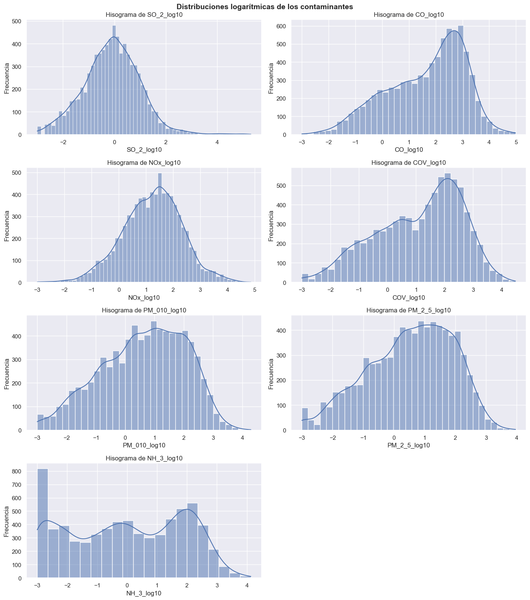
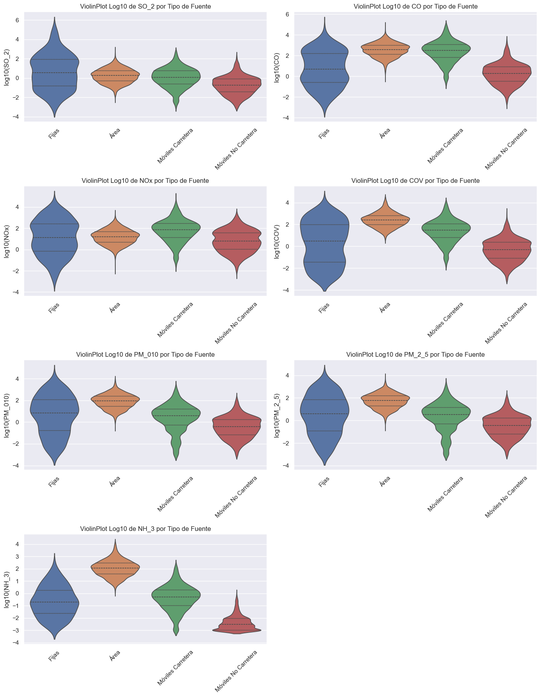
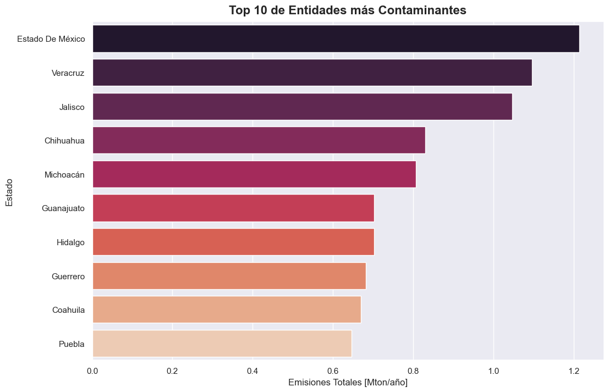
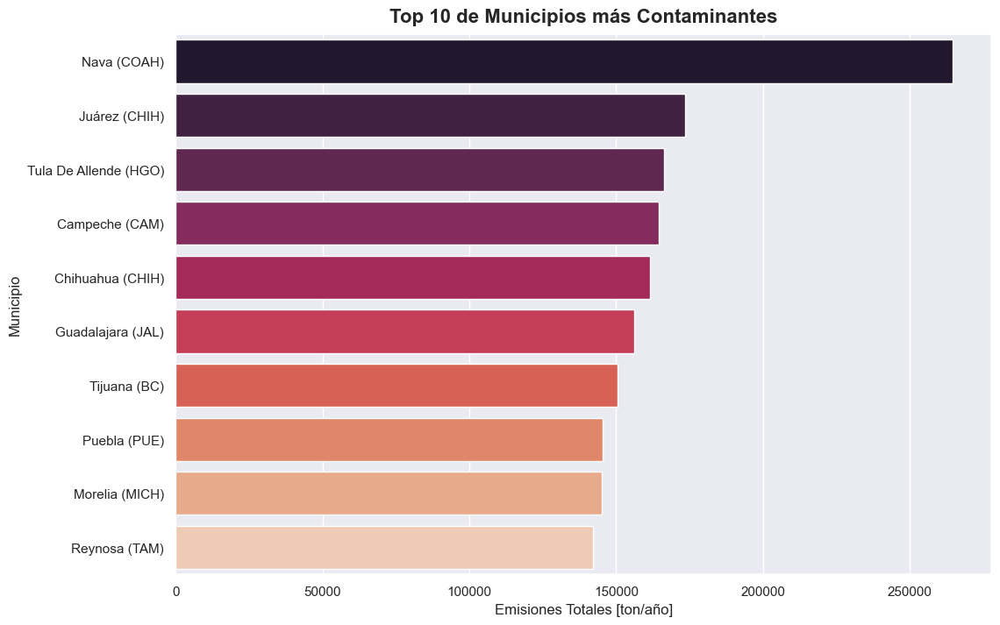
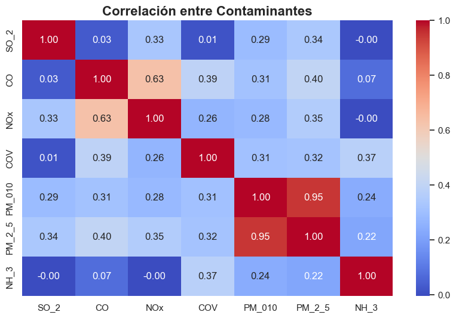
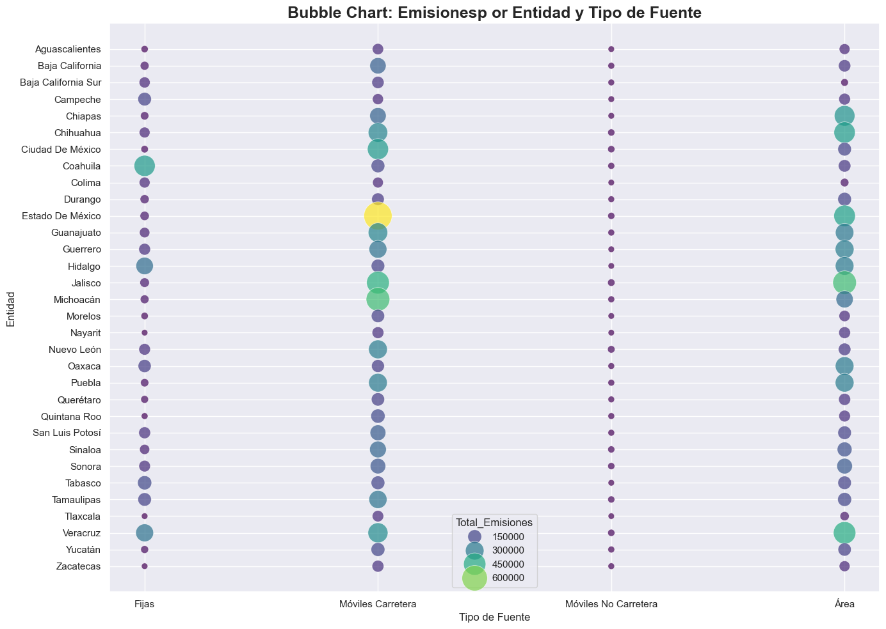
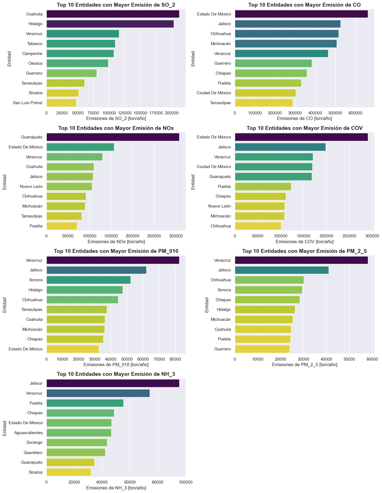
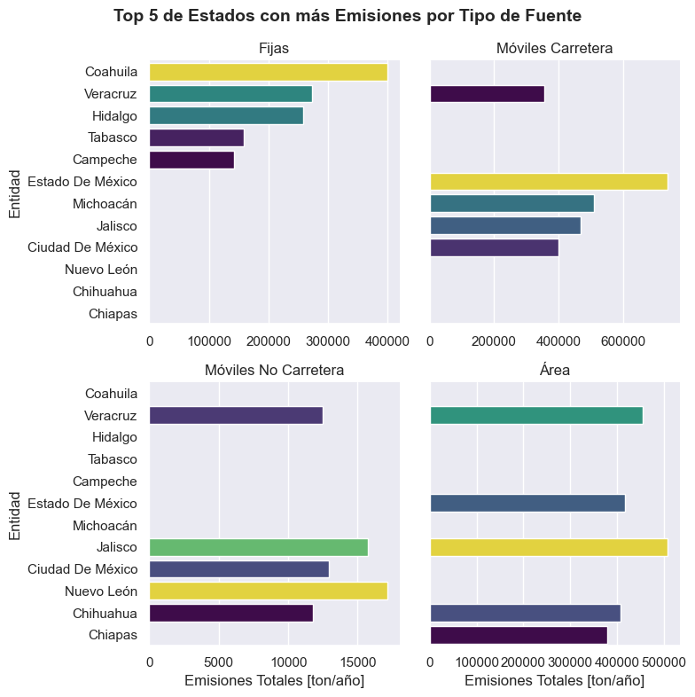

# Análisis de Emisiones en México
Análisis Exploratorio de Emisiones Contaminantes reportadas por entidades del país, con enfoque en tipos de fuentes emisoras y distribución geográfica. 

## Estructura del repositorio 
|**Archivo**|**Descripción**|
|---|---|
|```images```|Carpeta que incluye las visualizaciones elaboradas|
|```01_EDA.ipynb```| Notebook de análisis|
|```README.md```|Descripción del proyecto|
## Descripción general
Este proyecto realzia un **Análisis Exploratorio de Datos (EDA)** sobre el inventario de emisiones atmosféricas en México. 
Se busca responder lo siguiente:
- ¿Qué entidades federativas emiten más contaminantes?
- ¿Qué tipo de fuentes contribuyen más?
- ¿Qué contaminantes predominan por región o fuente?

Se generaron múltiples visualizaciones, incluyendo violinplots, boxplots, heatmaps y barplots por contaminantes. 

## Limpieza y Preprocesamiento
- **Carga e Inspección inicial**
  - Revisión del esquema del dataset
  - Identificación de tipos de datos
  - Exploración de datos faltantes
- **Estandarización**
  - Homologación de nombres de columnas
  - Uniformidad de los nombres de estados y fuentes
  - Abreviación del nombre de los estados para visualizaciones
. **Manejo de valores faltantes y  duplicados**
  - Eliminación de valores faltantes
## Análisis Exploratorio de Datos (EDA)
Gráficos utilizados
- Boxplots
- Violinplots
Estos gráficos permiten observar:
- Observar la dispersión
- Detectar outliers
### Comparación entre tipos fuente
- Emisiones totales por categoría
- Top 5 de fuentes que más contaminan por cada contaminante
- Comparaciones con escalas logarítmicas
### Comparación geográfica
- Top 10 estados que más emiten contaminantes
- Top 10 estados que menos emiten contaminantes
- Top 10 municipios que más emiten contaminantes
- Top 10 municipios que menos emiten contaminantes

### Análisis combinado
- **Bubble chart**: Estado x tipo de fuente x emisiones
## Visualizaciones
### Distribución de Contaminantes


### Violinplots de contaminantes por tipo de fuente


### Top 10 de Estados más Contaminantes


### Top 10 Municipios más Contaminantes


### Correlación entre contaminantes


### Bubble Chart: Estado x tipo de fuente x emisiones


### Top 10 Estados por Contaminante
 

### Top 5 de Estados con más Emisiones por Tipo de Fuente
 

### Radar Charts: Tipo de Fuente y Contaminantes
## Resultados Clave
- Existen estados que destacan de forma consistente como los mayores emisores como:
  - Estado de México
  - Veracruz
  - Jalisco
  - Chihuahua
  - Michoacán
- Los contaminantes presentan distribuciones con colas largas y con muchos outliers, por lo que, es necesario usar logaritmos para visualizar su comportamiento.
- Las fuentes que más contaminan son:
  1. Móviles de Carretera
  2. Área
  3. Fijas
  4. Móviles No Carretera
- Hay una fuerte correlación entre PM10 y PM2.5
- La mayoría de los emisiones móviles carretera son de contaminantes NOx y CO.
- Las fuentes de área emiten, mayoritariamente, COV, NH3, PM10 y PM2.5 
## Tecnologías Utilizadas
- Python 3.x
- Pandas
- NumPy
- Matplotlib
- Seaborn
- Jupyter Notebook 
## Fuente
- [Inventario de emisiones de contaminantes atmosféricos por municipio y fuente, 2018 - SEMARNAT](https://datos.gob.mx/dataset/calidad_aire_emisiones_contaminantes/resource/70dfeb69-065b-4ed4-8922-505602666250)
## Autor
- [Andrés Guzmán Rodríguez](https://github.com/AndrsGzRo)
